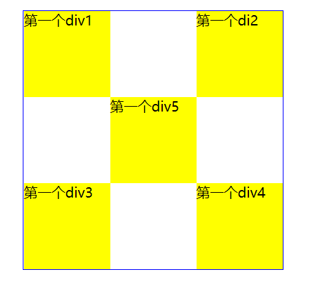

#  CSS

html： 内容  (文本框)

css:   样式 （给文本框设置 长度、宽度、颜色）

css优势：

- 内容与样式相分离
- css样式更加丰富
- 提高浏览器的加载速度、节约网络带宽，减少代码量
- 利于SEO优化

## 基本语法

选择器

{

​	样式名：样式值 ;

​	样式名：样式值 ;

​	样式名：样式值 ;

​	...

}

颜色：支持英文单词、#6个或3个十六进制

```html
<html>

	<head>

		<meta charset="utf-8" /> 

		<title>CSS</title>
		
		<style type="text/css">
				h1
				{
					color: red;  /*  #154245  */
					font-size : 20px ;
				}
		</style>
			
	</head>


	<body>  
			<h1>h1标签</h1>
			<h1>h1标签</h1>
			<h2>h2标签</h2>
			<h3>h3标签</h3>
			<h1>h1标签</h1>
			
	</body>
</html>


```

选择器：

- 标签选择器：直接编写标签名 h1  , p
- 类选择器：  .class值  ，可以用于多个元素
- id选择器：  #id值，只能用于一个元素

## 引入CSS样式的方式

- 行内样式
- 内部样式      head  style
- 外部样式

建议：在开发时 用内部样式；编写完毕后 改造成外部 ；

行内：不推荐， 赶时间、应急

行内：

```html
<h4 style="color:red;background-color:green;">  h4样式</h4>
```

内部

```html
	<head>
		<title>CSS</title>
		
		<style type="text/css">
				h1
				{
					color: red;  /*  #154245  */
					font-size : 20px ;
				}
				
		</style>
			
	</head>
```

外部：

先将样式独立保存在一个.css文件中，然后再在html文件中引入该.css文件

```html
<head>
		<!--外部样式：推荐做法link -->
		<link href="文件名.css" type="text/css" rel="stylesheet"/>
			
</head>
```

了解（不推荐）：

```htm
		
		<style type="text/css">
				<!-- 外部样式-->
				@import url("mycss.css") ;
		</style>
```


外部导入的两种方式（链接式,link； 导入式,@import）区别 ：

- 推荐link
- link属于xhtml规范； @import属于css2.1标准
- link将css预先加载到网页中，再进行编译显示
- @import：先显示网页结构，然后再加载CSS内容
- @import是css2.1独有的


> 提示： 注释：html <!-- -->，在css中注释 /*  */

CSS优先级问题： 

行内优先级 >外部 >内部

id选择器>类选择器 >标签选择器


## 复合选择器

提前：样式会继承，例如选择 ul，会给ul下面的li 起作用

## CSS2.1

后代选择器： 空格

交集选择器：连续书写 （没有继承性），要防止歧义

并集选择器：逗号 ,  


## CSS3 （类似jquery）

- 层次选择器

  - 后代选择器 ： 空格
  - 子选择器： >
  - 相邻同辈选择器（只对 后面的元素有效）: +
  - 通用同辈选择器（只对 后面的元素有效）: ~

- 结构伪类选择器

  ```html
  <html>
  
  	<head>
  
  		<meta charset="utf-8" /> 
  
  		<title>CSS</title>
  		
  		<style type="text/css">
  			/* 层次
  			ul>li
  			{
  				color : red ;
  			}
  			h4+h1
  			{
  				color:blue ;
  			}
  			h4~h1
  			{
  				color:blue ;
  			}
  			*/
  			/* 伪类选择器 */
  			li:first-child
  			{
  				color :yellow ;
  			}
  			
  			li:last-child
  			{
  				color :red ;
  			}
  			
  			li:nth-child(3)
  			{
  				color: green ; 
  			}
  			
  			p:first-of-type{
  				background-color : purple ;
  			
  			}
  			
  			p:last-of-type{
  				background-color : pink ;
  			
  			}
  			
  			p:nth-of-type(2){
  				background-color : red ;
  			
  			}
  		</style>	
  	</head>
  	<body>  
  			<p>p1p1</p>
  			<p>p2p2</p>
  			<p>p3p3</p>
  			<p>p4p4</p>
  	
  	
  			<ul>
  				<li>aaa</li>
  				<li>bbb</li>
  				<li>ccc</li>
  				<li>ddd</li>
  			</ul>
  	
  			<h1>1111</h1>
  			<h1>1111</h1>
  			<h4>h4h4h4</h4>
  			<h1>AAAA111</h1>
  			<h1>AAAA222</h1>
  			<h1>1111</h1>
  			
  			
  			<h4>h4h4h4</h4>
  			<h1>BBBB11</h1>
  			<h1>BBBB22</h1>
  
  
  	
  	</body>
  </html>
  
  
  ```

  

- 属性选择器[]

  ```html
  <html>
  
  	<head>
  
  		<meta charset="utf-8" /> 
  
  		<title>CSS</title>
  		
  		<style type="text/css">
  			/* 层次
  			ul>li
  			{
  				color : red ;
  			}
  			h4+h1
  			{
  				color:blue ;
  			}
  			h4~h1
  			{
  				color:blue ;
  			}
  			*/
  			/* 伪类选择器 */
  			li:first-child
  			{
  				color :yellow ;
  			}
  			
  			li:last-child
  			{
  				color :red ;
  			}
  			
  			li:nth-child(3)
  			{
  				color: green ; 
  			}
  			
  			p:first-of-type{
  				background-color : purple ;
  			
  			}
  			
  			p:last-of-type{
  				background-color : pink ;
  			
  			}
  			
  			p:nth-of-type(2){
  				background-color : red ;
  			
  			}
  			/*选择有name属性，且标签是input的 
  			input[name]{
  				background-color: yellow ;
  			}*/
  			/*input，有name，且name的值是username
  			input[name="username"]{
  				background-color: yellow ;
  			}
  			*/
  			
  			/*name是以user开头的元素
  			input[name^=user]
  			{
  				background-color:green ;
  			}*/
  			/*以name结尾
  			input[name$=name]
  			{
  				background-color: purple;
  			}
  			*/
  			/*包含i的*/
  			input[name*=i]{
  				background-color: pink ; 
  			}
  		</style>	
  	</head>
  	<body>  
  	
  			<form>
  				id:<input type="text" name="uid" /><br/>
  				用户名:<input type="text" name="usernickname" /><br/>
  				真实名字:<input type="text" name="username" /><br/>
  				密码：<input type="password" name="pwd"/><br/>			
  			</form>
  	
  			<p>p1p1</p>
  			<p>p2p2</p>
  			<p>p3p3</p>
  			<p>p4p4</p>
  	
  	
  			<ul>
  				<li>aaa</li>
  				<li>bbb</li>
  				<li>ccc</li>
  				<li>ddd</li>
  			</ul>
  	
  			<h1>1111</h1>
  			<h1>1111</h1>
  			<h4>h4h4h4</h4>
  			<h1>AAAA111</h1>
  			<h1>AAAA222</h1>
  			<h1>1111</h1>
  			
  			
  			<h4>h4h4h4</h4>
  			<h1>BBBB11</h1>
  			<h1>BBBB22</h1>
  
  	</body>
  </html>
  
  
  ```
  
  
  
  

## 盒子模型

作用/意义： 决定不同类型元素之间的位置关系（平面位置、空间位置）

background-color， h1

h1 , 外边距


网页元素 - 类比 盒子 


空间位置的 覆盖关系： 从下往上： 背景色<背景图片<元素内容


边框：border

边框颜色：border-color ;

border-color : red ;  代表上下左右四个边框 全是红色

border-color : red  yellow;  上下：red   左右:yellow

border-color : red  yellow blue;   上    "左右"   下

border-color : red  yellow blue green; 上 右  下 左    （顺时针）


border-top-color :blue ;

border-bottom-color :yellow;

border-left-color :red;

border-right-color :green;


边框粗细 border -width ; 

				border-width: medium ;
				
				border-width: thin  ;
				border-width: thick  ;
				border-width: 10px  ;


				border-width: thick thin 10px 100px;
				border-top-width: 100px ;


边框样式border-style ;

				border-style : solid double dotted dashed;   
				
				border-top-style : solid;
边框可以缩写：

border: solid  1px  red ;


缩写：

border - top :


外边距：margin

					/*margin-top:100px;
					margin-bottom:100px;
					margin:100px 0 100px 1 ;


​					margin:10px  0 ;
​					

					margin-top: 100px;


内边距：

					padding-top:30px;
					padding-bottom:10px;
					padding-right:0px;
					padding-left:130px;


盒子模型案例1：


```html
<html>

	<head>

		<meta charset="utf-8" /> 

		<title>CSS</title>
		
		<style type="text/css">
			li
			{
				list-style: none ;

			}
			
			body,ul,li,h1
			{
				margin:0px ;
				padding:0px ;
			}
			
			#games_list ul li a{
				text-decoration: none ;
				color: #000 ;
			}
			
			/*a:hover  表示鼠标悬浮的样式*/
			#games_list ul li a:hover{
				color:lightgray ;
			}
			

			#games_list
			{
				/*solid:实线
					gray:颜色 灰色
					1px：边框促销
				*/
				
				border:solid gray 1px;
				width:124px;
				/*内边距*/
				padding-bottom: 10px ;
				background-color: #c0d4ef  ;
				/*外边距*/
				margin:10px auto ;

			}
		
			.title{
				background:url(imgs/title_icon.png)  5px 8px   no-repeat	;
				padding-left : 20px ;
				color: gray ;
				line-height:30px;
				font-size: 15px ;
			}
			
			#games_list>ul
			{
				padding-left:10px ;
				padding-right:15px ;
			}
			
			#games_list>ul>li
			{
				background: url(imgs/right.png) right -5px no-repeat ;
				border-top:solid 1px blue ;
			}
		</style>	
	</head>
	<body>  
			<div id="games_list">
				<h1 class="title">游戏列表</h1>
				<ul>
						<li><a href="#">超级玛丽</a></li>
						<li><a href="#">贪吃蛇</a></li>
						<li><a href="#">红色警戒</a></li>
						<li><a href="#">魂斗罗</a></li>
						<li><a href="#">蜘蛛纸牌</a></li>
				</ul>
			</div>
	
		

	
	</body>
</html>


```

案例二：


```html
<html>

	<head>

		<meta charset="utf-8" /> 

		<title>盒子模型-商品列表</title>
		
		<style type="text/css">
			body,div,h1,dl,dt,dd{
				margin: 0px;
				padding: 0px ;
			}
			
			#production{
				background-color: #fffff2 ;
				width: 195px ;
			}
			
			#production>h1
			{
					font-size: 25px ;
					font-weight: bold ;
					line-height: 40px ;
					text-indent: 1em ;
			}
			
			#production>dl>dt{
				padding-left: 25px ;
				line-height: 30px ;
				font-size: 15px ;
			}
			
			#production>dl>dd{
				padding-left: 25px ;
				line-height: 25px ;
				font-size: 13px ;
				border-bottom: 1px dashed lightgray	 ;
			}
			
			#production .dianzi
			{
				background: url(imgs/dianzi.png) 4px 5px no-repeat
			
			}
			
			#production .fuzhuang
			{
				background: url(imgs/fuzhuang.png) 4px 5px no-repeat
				
			}
			
			
		</style>	
	</head>
	<body>  

	
	
		<div id="production">
			<h1>全部分类</h1>
			<dl>
				<dt class="dianzi">电子设备</dt>
				<dd>	
					手机/电脑/笔记本/鼠标<br/>
					手机/电脑/笔记本/鼠标<br/>
					手机/电脑/笔记本/鼠标<br/>
					手机/电脑/笔记本/鼠标<br/>
					手机/电脑/笔记本/鼠标<br/>
				</dd>
			</dl>

			<dl>
				<dt class="fuzhuang">服装</dt>
				<dd>	
					男装/女装/春装/秋装<br/>
					男装/女装/春装/秋装<br/>
					男装/女装/春装/秋装<br/>
					男装/女装/春装/秋装<br/>
					男装/女装/春装/秋装<br/>
				</dd>
			</dl>
		</div>
	</body>
</html>


```

案例：图片列表


```html
<html>

	<head>

		<meta charset="utf-8" /> 

		<title>盒子模型-商品列表</title>
		
		<style type="text/css">
			div,h1,ul,li,a
			{
				/*为了防止各个浏览器的内边距、外边距不兼容情况，一般在开发时 第一步将边距全设置为0  */
				margin: 0px ; 
				padding:0px ;
			}
			
			ul,li
			{
				list-style-type: none ;
			}
			
			#production
			{
				/* background-color: yellow ; */
				width: 318px ;
			}
			
			#production>h1{
				margin-left: 5px ;
				background-color: #24221e ;
				font-family: SimHei, Georgia, 'New York', Times, TimesNR, 'New Century Schoolbook',
     serif;
				font-weight: 700;
				font-size: 24px;
				color: #FFF ;
				line-height: 32px;
				padding-left: 18px;
			}
			
			ul li a img
			{
				border: 5px solid #FFF;
			}
			
			ul li a:hover img
			{
				border: 5px solid rgba(255,144,0, 0.3);
			}
			
			
		</style>	
	</head>
	<body>  
	
		<div id="production">
			<h1>1F 电子设备</h1>
			<ul>
				<li> 
					<a href="#"> 
							 </img>   
					</a>  
				</li>
				
				<li> 
					<a href="#"> 
							 </img>   
					</a>  
				</li>
				
				<li> 
					<a href="#"> 
							 </img>   
					</a>  
				</li>
				

				
			</ul>
			
			
		</div>
	</body>
</html>


```


## 标签

div：块级元素，换行

span： 内联元素，不换行


## CSS样式（有些样式存在浏览器兼容问题）

font-size:字体大小  px   em rem  cm  mm pt pc 

font-style:normal(默认)，  italic/oblique

font-weight: bold  bolder  normal  lighter  100-900

text-indent:缩进  2em

line-height: 100px

text-decoration:  underline/overline/text-though

color:英语单词red    十六进制（3位或6位）  rgbcolor : rgb(11,192,15)     rgba(1,27,182,0.5)  ;

其中a代表透明度  0-1之间的小数，0.3代表显示程度是30%

阴影text-shadow: 横坐标 纵坐标 发散程度

a:hover 悬浮

a:link 未访问

a:visited 已经访问过了

a:active 点击鼠标时

设置的顺序： link -> visitied > hover > active

一般建议： 只写 hover 即可


鼠标样式：cursor:pointer

https://www.w3school.com.cn/cssref/pr_class_cursor.asp


list-style-type: disc/none/square/decimal/circle


background-image:url(图片地址)

background:blue url(imgs/fuzhuang.png)  right  top no-repeat ;

repeat-x 

repeat-y

				background:url(imgs/bg.png)  no-repeat ;
				background-size:cover ;
	cover:铺满整个区域
	background-size: 50%  60%  ;
	表示 宽占整个网页的50%  ，高占整个网页的60%
	auto:默认，原图大小


边框的圆角：圆角边框

border-raduis:

```html
<html>

	<head>

		<meta charset="utf-8" /> 
		<title>圆角边框</title>
		<style type="text/css">
			div{
				/*box-shadow:横坐标 纵坐标 范围 颜色*/
				box-shadow:  10px 20px 10px gray ;
			
				width: 100px  ;
				height: 50px  ;
				border: 3px solid red ;
				/* border-radius: 10px 50px 80px 100px ;
				border-radius: 50px  ; 
				border-radius: 50px 100px  ;
				border-radius: 50px 100px  10px ;*/
				margin: 50px 0 ;
			}
			
			.divclass2
			{
				width: 50px  ;
				height: 100px  ;
				border: 3px solid red ;
			
			}
			
			
			
			div:nth-of-type(2){
				border-radius: 50px 50px 0 0 ;
			}
			
						
			div:nth-of-type(3){
				border-radius:  0 0 50px 50px ;
			}
			
			div:nth-of-type(4){
				border-radius:  0 50px 50px 0 ;
			}
			
			div:nth-of-type(5){
				border-radius:  50px 0 0 50px ;
			}
			
			#sx div
			{
				height: 50px ;
				width: 50px ;
				border: 3px blue solid ;
			}
			#sx div:nth-of-type(1){
				border-radius:50px 0 0 0 ;
			}
						
			#sx div:nth-of-type(2){
				border-radius: 0 50px 0 0 ;
			}
						
			#sx div:nth-of-type(3){
				border-radius: 0 0 50px  0 ;
			}
						
			#sx div:nth-of-type(4){
					border-radius: 0 0 0 50px  ;
			}
			
		</style>	
	</head>
	<body>  
			<div></div>
			<div></div>
			<div ></div>
			<div class="divclass2"></div>
			<div class="divclass2"></div>
			
			<div id="sx">
					<div></div>
					<div></div>
					<div></div>
					<div></div>
			
			</div>

	</body>
</html>


```

## 标准文档流

## 组成

- 块级元素（block level）：自带换行 div ，可以设置宽和高

- 内联元素 (inline level) ：不换行  span, a  ，没有宽和高   （内敛元素不遵守盒子模型）

- inline-block：1.如果inline失效，可以尝试inline-block

  ​						 2.可以设置宽和高

  块级元素可以包含内敛，反之不行。

  正确：

  ```html
  			<div>
  				begin..
  				<span>span</span>
  				<span>span</span>
  				end...
  			
  			</div>
  ```

  错误：

  ```html
  			<span>
  				begin..
  				<div>divdiv</div>
  				<div>divdiv</div>
  				end...
  			</span>
  ```

  内敛元素和块级元素相互切换：

  display:  block |  inline   |none |inline-block ;

  示例：

  

  

```html
<html>

	<head>

		<meta charset="utf-8" /> 

		<title>网站导航</title>
		
		<style type="text/css">
			*{
				margin: 0px ;
				padding: 0px ;
			}
			
			a{
				text-decoration: none ;
			}


			.nav-header
			{
				width: 100% ;
				height:85px ;
				background: rgba(0,0,0,0.7);
			}
			
			.head-contain
			{
				width: 700px ;
				height: 85px ;
				margin:0 auto ;
				text-align:center ;
			}
			
			.top-logo,.top-nav,.top-nav li,.top-right
			{
				display: inline-block ;
				vertical-align:top ;
				margin-top: 15px ;
			}
			
			.top-nav li
			{
				width: 90px ;
			}
			
			.top-nav li a
			{
				font-size: 17px ;
				color: #fff ;
				
			}
			
			.top-nav li a:hover
			{

				color: blue ;			
			}
			
			.top-right a
			{
				display:inline-block ;/*将内敛元素 转为 块级元素，使之遵循盒子模型*/
				font-size: 17px ;
				margin-top: 10px ;
				border-radius:30px ;
			}
			
			.top-right a:first-of-type
			{
				width:75px ;
				height: 35px ;
				border:1px orange solid ;
				line-height:35px ;
			}
			
			.top-right a:first-of-type:hover
			{
				color:red ;
				background: orange;
			}
			
		</style>	

	</head>
	<body> 
		<header class="nav-header">
			<div class="head-contain">
				<a href="#" class="top-logo"></a>
				<nav class="top-nav">
					<ul>
						<li><a href="#">旅游天地</a></li>
						<li><a href="#">美食城</a></li>
						<li><a href="#">成长体系</a></li>
						<li><a href="#">当地特色</a></li>
						<li><a href="#">重点推荐</a></li>

					</ul>
				</nav>
				<div class="top-right">
					<a href="#">登录</a>
					<a href="#">开通会员</a>
				</div>
			</div>
		</header>
	</body>
</html>


```

## 浮动（float）

块级元素 -> 内敛元素 ：将不同行的元素放置到一行

浮动 ：将不同行的元素放置到一行

float: none | left | right


浮动（压缩）：压缩的是**自己**的空间

clear: 清除浮动（清除一半，还原了 块级元素的 换行特性，但没有还原空间）

clear:清除的是上一个元素（不是自己）

clear:left | right |both


```html
<html>
	<head>
	<meta charset=utf-8/>
	<title>浮动</title>
	<style  type="text/css" >

		
		#father div
		{	
			border: 2px solid red ; 
			margin: 10px 0 ;
			background-color:yellow ; 
			
		}
		
		#father .mydiv1{
			float:left ; 
		}
		
		#father .mydiv2{
			clear: left ;
		}
		
		#father .mydiv3{
		
		}
		
		#father .mydiv3{
			
		}
	</style>
	</head>
	<body>
	  <div id="father">
	  
			
	  
		    <div class="mydiv1"></div>
			
		    <div class="mydiv2"></div>
		  
		    <div class="mydiv3"></div>
			<div class="mydiv4">
			这是浮动的演示案例...这是浮动的演示案例...这是浮动的演示案例...这是浮动的演示案例...这是浮动的演示案例...
			这是浮动的演示案例...这是浮动的演示案例...这是浮动的演示案例...这是浮动的演示案例...这是浮动的演示案例...
			</div>
	  </div>
	</body>
</html>

```


浮动的元素：不在标准文档流之中 （网页无法识别原有的空间），脱离原有空间


```html
<html>
	<head>
	<meta charset=utf-8/>
	<title>商品列表</title>
	<style  type="text/css" >
		*{
			margin: 0 ;
			padding: 0 ;
		}
		
		.shangpin ul  li
		{
			list-style: none ;
		}
		
		.shangpin{
			width: 720px ;
			/* background-color: yellow ; 	*/
			margin:10px auto ;
		
		}
		
		.shangpin h1
		{
			font-size:25px ; 
		}
		.shangpin h1 span
		{
			float:right ;
			margin-right:20px ;
			color: gray ; 
			font-size: 18px ; 
		}
		.shangpin ul li
		{
		
			float:left ;
			margin:20px ;
		}
		
		.shangpin ul li p
		{
			font-size: 15px;
			color: blue ;
		}
		
	
	</style>
	</head>
	<body>
	

		<div class="shangpin">
			<h1>商品列表<span>更多</span></h1>
			<ul>
				<li>
					
					<p>推荐商品 | 1024节爆款电脑</p>
				</li>		
				
				<li>
					
					<p>推荐商品 | 程序员节鼠标</p>
				</li>		
				
				<li>
					
					<p>推荐商品 | 程序猿节背包</p>
				</li>	
				
				<li>
					
					<p>推荐商品 | 程序媛节笔记本</p>
				</li>

			</ul>
		</div>
	</body>
</html>

```


display:   block  | inline   |none | inline-block;

float: left | right ;


## 溢出overflow

overflow: visible  | hidden  |scroll |auto;

scroll: 不论是否超出，都有滚动条

auto:如果超出，有滚动条；否则没有


```html

<html >
	<head>
	<meta charset=utf-8 />
	<title>overflow</title>
	<style  type="text/css" >

	body {

	}

	#content {
		width:400px;
		height:350px;
		border:1px red solid;
		overflow:auto ;
	}


	</style>
	</head>
	
	<body>

		
	
		<div id="content">
		  
		  <p >111111这是一些文是一些文是一些文是一
		  
		  
		  些文是一些文是一些文是一
		  些文是一些文是一些文是一
		  些文是一些文是一些文是一
		  些文是一些文是一些文是一
		  些文是一些文是一些文是一
		  些文是一些文是一些文是一
		  些文是一些文是一些文是一
		  些文是一些文是一些文是一
		  些文是一些文是一些文是一
		  些文是一些文是一些文是一
		  些文是一些文是一些文是一
		  些文是一些文是一些文是一
		  些文是一些文是一些文是一
		  些文是一些文是一些文是一
		  些文是一些文是一些文是一
		  些文是一些文是一些文是一
		  些文是一些文是一些文是一
		  些文是一些文是一些文是一
		  些文是一些文是一些文是一
		  些文是一些文是一些文是一
		  些文是一些文是一些文是一
		  些文是一些文是一些文是一
		  些文是一些文是一些文是一
		  
		  
		  些文是一些文是一些文是</p>
		  
		</div>
		
	</body>
</html>

```


## 定位

position: static(默认值，没有定位) | relative(相对定位) | absolute(绝对定位) |fixed（固定定位，个别版本浏览器不支持）


relative：相对于自身

注意位置：left是指往右便宜；top是下；其他同理


```html
<html>
	<head>
	<meta charset=utf-8/>
	<title>浮动</title>
	<style  type="text/css" >
		div
		{
			border: 1px solid red ;
			margin:20px ;
		}
		
		#father div
		{
			height:150px ;
			background:lightgray ;
		}
		
		.mydiv1
		{
			position: relative ;
			right:-50px ;
			bottom:-50px ;
		
		}
		
	</style>
	</head>
	<body>
	
	
	
	  <div id="father">
	
	  
		    <div class="mydiv1">第一个div</div>
			
		    <div class="mydiv2">第一个di2</div>
		  
		    <div class="mydiv3">第一个div3</div>

	  </div>
	</body>
</html>

```



```html
<html>
	<head>
	<meta charset=utf-8/>
	<title>浮动</title>
	<style  type="text/css" >
		#father{
			border: 1px solid blue ;
		}
		#father div
		{
			background-color: yellow  ;

		}
		
		#father
		{
			width: 300px ;
			height:300px ;
			margin:50px auto ;
		}
		
		#father div
		{
			width: 100px ;
			height:100px ;
		}
		
		.mydiv2,.mydiv4{
			position:relative ;
			left:200px ;
			top :-100px ;
		}

		.mydiv5
		{
			position: relative ;
			top: -300px ;
			right:-100px ;
		}

		
	</style>
	</head>
	<body>
	
	
	
	  <div id="father">
	
	  
		    <div class="mydiv1">第一个div1</div>
			
		    <div class="mydiv2">第一个di2</div>
		  
		    <div class="mydiv3">第一个div3</div>
			
		    <div class="mydiv4">第一个div4</div>
			
		    <div class="mydiv5">第一个div5</div>

	  </div>
	</body>
</html>

```


绝对定位：

position: absolute

是否存在 “已经定位的祖先元素”

- 存在 ：则参照 “已经定位的祖先元素”定位
- 不存在： 则参照浏览器定位

绝对定位：会脱离文档流（释放空间，会让网页无法识别）


```html
<html>
	<head>
	<meta charset=utf-8/>
	<title>绝对定位（没有已经定位的祖先元素）</title>
	<style  type="text/css" >
		
		div
		{
			width:100px ;
			height:100px ;
			background: yellow ;
			
			position:absolute ;
			right :30px ;
			bottom: 30px ;
			 
		}
		
	</style>
	</head>
	<body>
	
	
	
	  <div >

		
	  </div>
	  
	  
	</body>
</html>

```


```html
<html>
	<head>
	<meta charset=utf-8/>
	<title>绝对定位（有已经定位的祖先元素）</title>
	<style  type="text/css" >
		
		#father
		{
			width:600px ;
			height:600px ;
			border:1px solid blue ; 
			position: relative;
			top :30px ;
			left: 30px ;
	 
		}
		
		#father div
		{
			height:100px ;
			width: 200px ;

		}
		.mydiv1
		{
			background-color: red ;
		}
		
		.mydiv2
		{
			background-color: yellow ;
			position: absolute ;
			right: 100px ;
		}
		
		.mydiv3
		{
			background-color: blue ;
		}
		
	</style>
	</head>
	<body>
	
	
	
	  <div id="father">
			<div class="mydiv1">red</div>
			<div class="mydiv2">yellow</div>
			<div class="mydiv3">blue</div>
		
	  </div>
	  
	  
	</body>
</html>

```


position:fixed   参照浏览器定位


```html
<html>
	<head>
	<meta charset=utf-8/>
	<title>绝对定位（有已经定位的祖先元素）</title>
	<style  type="text/css" >
		

		
	
		.mydiv1
		{
			background-color: red ;
			height:200px ;
			width:200px ;
			
			position:fixed ;
			right:10px ;
			top:100px ;
		}
		
		.mydiv2
		{
			background-color: yellow ;
			height:80px ;
			width:100% ;
			position:fixed ;
			bottom:0 ;

		}
		

		
	</style>
	</head>
	<body>
	
	
	

			<div class="mydiv1">red</div>
			<a href="https://www.baidu.com"><div class="mydiv2">yellow</div></a>
		
		
		<p>xxxxxxxxxx</p>
		<p>xxxxxxxxxx</p>
		<p>xxxxxxxxxx</p>
		<p>xxxxxxxxxx</p>
		<p>xxxxxxxxxx</p>
		<p>xxxxxxxxxx</p>
		<p>xxxxxxxxxx</p>
		<p>xxxxxxxxxx</p>
		<p>xxxxxxxxxx</p>
		<p>xxxxxxxxxx</p>
		<p>xxxxxxxxxx</p>
		<p>xxxxxxxxxx</p>
		<p>xxxxxxxxxx</p>
		<p>xxxxxxxxxx</p>
		<p>xxxxxxxxxx</p>
		<p>xxxxxxxxxx</p>
		<p>xxxxxxxxxx</p>
		<p>xxxxxxxxxx</p>
		<p>xxxxxxxxxx</p>
		<p>xxxxxxxxxx</p>
		<p>xxxxxxxxxx</p>
		<p>xxxxxxxxxx</p>
		<p>xxxxxxxxxx</p>
		<p>xxxxxxxxxx</p>
		<p>xxxxxxxxxx</p>
		<p>xxxxxxxxxx</p>
		<p>xxxxxxxxxx</p>
		<p>xxxxxxxxxx</p>
		<p>xxxxxxxxxx</p>
		<p>xxxxxxxxxx</p>
		<p>xxxxxxxxxx</p>
		<p>xxxxxxxxxx</p>
		<p>xxxxxxxxxx</p>
		<p>xxxxxxxxxx</p>
		<p>xxxxxxxxxx</p>
		<p>xxxxxxxxxx</p>
		<p>xxxxxxxxxx</p>
		<p>xxxxxxxxxx</p>
		<p>xxxxxxxxxx</p>
		<p>xxxxxxxxxx</p>
		<p>xxxxxxxxxx</p>
		<p>xxxxxxxxxx</p>
		<p>xxxxxxxxxx</p>
		<p>xxxxxxxxxx</p>
		<p>xxxxxxxxxx</p>
		<p>xxxxxxxxxx</p>
		<p>xxxxxxxxxx</p>
		<p>xxxxxxxxxx</p>
		<p>xxxxxxxxxx</p>
	  
	  
	</body>
</html>

```


定位：

相对：relative  ，相对于自身定位

绝对：absolute，（如果有已定位的祖先：参照祖先 ；如果没有，参照浏览器）

fixed: 参照浏览器


```html
<html>

	<head>

		<meta charset="utf-8" /> 
		<title>轮播图</title>
		<!--html注释 -->
		<style type="text/css">
				/*CSS注释 定位父(祖先)元素*/
				
				#adverImg {
				
					border: 5px solid lightgray ;
					width: 472px ;
					position:relative;

				}
				#number {
					position:absolute;
					right:5px;
					bottom:2px;
				}
				div ul li
				{
					float:left ;
					list-style-type:none;
					width:20px ;
					border:1px lightgray solid ;
					margin-right: 5px ;
					text-align:center ;
					background-color:#FFF ;
					font-size:12px;
					line-height:20px ;
				}

		
		</style>	
	</head>
	<body>  
		<div id="adverImg">
					
				<div  id="number">
					<ul>
						<li>1</li>
						<li>2</li>
						<li>3</li>
						<li>4</li>
						<li>5</li>
					</ul>
				</div>
		</div>
				
			
	</body>
</html>


```

## 透明度

- opacity:0.5

- filter:alpha(opacity=50)

> 浏览器兼容性问题，部分浏览器支持opacity，部分支持filter:alpha(opacity=50) .


## 动画

浏览器兼容问题 （部分浏览器 不支持）：

旧版本浏览器都不支持

过渡浏览器：需要加一些参数

			- IE9: -ms-
			- firefox: -moz-
			- chrome/safari:  -webkit-
			- Opera: -o- 

如果有@，则兼容性前缀增加到@的后面

@-webkit-keyframes x

新浏览器一般都支持


变形函数：transform:xx()

	- translate(x,y)： 平移
	- scale(x,y):放缩
	-  rotate(顺时针度数deg)：旋转

过渡：transition

				/*第三个参数：过渡的速度：
					ease :由快到慢
					linear: 匀速
					ease-in:越来越快
					ease-out:越来越慢
					ease-in-out:先加速后加速
					
				第四个参数： 延迟时间
				
				*/
				transition: width 5s ease-out  -3s ;


animation: 动画

