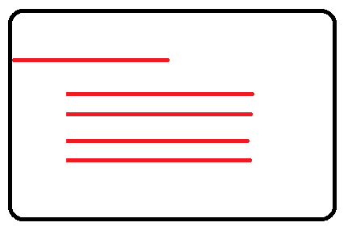
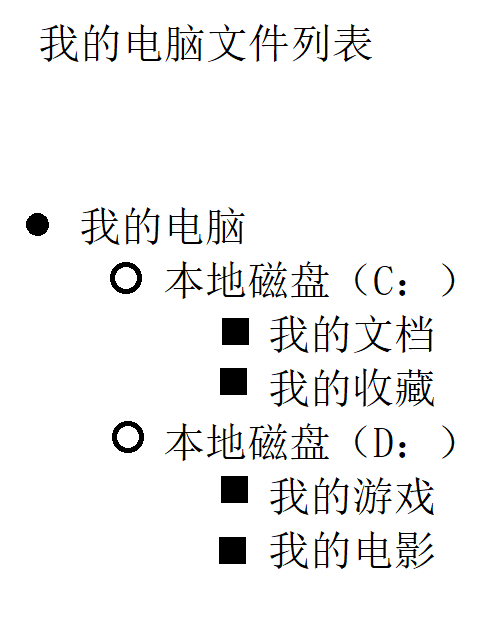
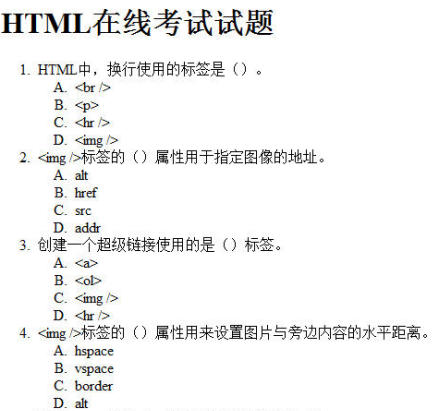
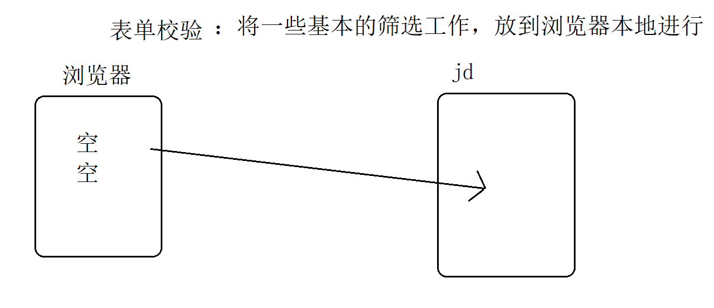

# 1.HTML

## 1.1 简介

html: hyper  text markup language  ，超文本标记语言

html 1.0  - 1993-06

html2.0  - 1995-11

html 3.x  - 1997-01

html 4.0 -1997-12

html 4.01 - 1999-12

html 5 - 2014-10


## 1.2 Html基本网页结构

格式： xxx.html(推荐)   xxx.htm

<!DOCTYPE html>  doctype声明
不区分大小写，容错性很强

乱码问题： 英文和数字在任何编码格式下 都不会有乱码（正常显示的）；其他的 都依赖于编码类型。

w3c规定：标准写法有两种

​	<标签></标签>

​	<标签       />

w3c标准 ：

-  具体的实现产品html css  javascript
- html版本
- html和xhtml的区别
- html内容的语义化

``` html
<html>
	<!-- 声明式：不能显示 -->
	<head>
		<!-- 设置网页编码 -->
		<meta charset="utf-8" /> 
		<!-- 关键词： 是否能被搜索引擎搜到 -->
		<meta name="keywords" content="学习html" />
		<!-- 描述：当搜到本网页时，展示的简介内容... -->
		<meta name="description" content="学习html非常的好，好啊啊啊啊啊啊...." />
		<title>我的标题 html...</title>
			
	</head>
	
	<!-- 能够显示的 -->
	<body>
			my context...
			我的内容您好
	</body>
</html>


```


## 1.3基本标签（重点）


标题标签

<h1\> ... \<h6\>

段落标签

\<p\> ..\</p> 

换行标签

\<br/>


水平线\<hr>

样式标签

​	加粗\<strong>\</strong>  或者\<b> \</b>

  倾斜\<em>\</em>


 ```html
	<!-- 能够显示的 -->
	<body>
			<p>11111111111111111...</p>
			<p>2222222</p>
			<h1>一级标题</h1>
			<h2>2级标题</h2>
			<h3>3级标题</h3>
			<h4>4级标题</h4>
			<h6>6级标题</h6>
			<hr/>
			hello world <strong>hello world</strong> hello <b>world</b> <em>hello</em> 
			<em><strong>world</strong></em>
			
				<strong>
					<em>
						world
					</em>
				</strong>
	</body>
 ```


## 1.4 特殊符号、注释

注释  <!-- -->

特殊符号  & ... ; 


## 图片

img


## 链接

普通超链接

锚链接

功能性链接: 邮件


## 调试

chrome: F12


## 列表

无序列表

​	ul  , li

``` html
		<ul type="circle">
			<li>苹果</li>
			<li type="disc">香蕉</li>
			<li>橘子</li>
		</ul>
```

type="disc|circle|square"


```html
<ul>
    <li>
        <ul> .. </ul>
    </li>
</ul>
```

ul中的元素可以嵌套，li中可以嵌套ul

经验：

```html
<ul>
    <li>
       
    </li>
    <ul> .. </ul>
</ul>
```


有序列表

ol , li

```html
		<ol type="I">
			<li>苹果</li>
			<li type="1">香蕉</li>
			<li>橘子</li>
		</ol>
```

type="1|a|A|i|I"

```html
<ol>
    <li>
        <ol></ol>
    </li>
    <ol></ol>
    <ul>  ...  </ul>
</ol>
```


定义列表



```html
<dl>
    <dt>标题</dt>
    <dd>正文内容正文内容正文内容正文内容正文内容正文内容正文内容正文内容正文内容正文内容正文内容正文内容正文内容</dd>
</dl>
```


示例：







## 表格

```html
			<table border="1px" >
				<!--表格table，行tr  ，列 td -->
				<tr align="right">
					<td rowspan="2">1-1</td>
					<td colspan="2" align="center">a</td>
					
				</tr>
				
	
				<tr>
			
					<td valign="middle">2-2</td>
					<td>2-3</td>
				</tr>
				<tr>
					<td>3-1</td>
					<td>3-2</td>
					<td  align="center">c</td>				
				</tr>

			
			</table>
```

水平移动 align="left|center|right"

垂直移动valign="top|middle|bottom"

跨行 rowspan="n"

跨列colspan="n"


## 表单

```html
			<!--method:表单提交方式  get（地址栏显示参数值，默认） , post（不显示，推荐） 
			
				size: 文本框/密码显示的长度
				maxlength:实际能够输入内容的长度
				
			文件：2个一起写，
				input type="file"
				enctype="multipart/form-data"
				
				
				隐藏域：type="hidden"。前台不显示，但真实存在
			-->
			<form action="result.html" method="post" enctype="multipart/form-data">
				<!--表单元素的标注 -->
				<label for="xa">西安</label>
				<input type="checkbox" id="xa"/>
	
				<!-- 语义化表单-->
				<fieldset>
					<legend>用户信息</legend>
					Helo<input />
					Helo<input />
				</fieldset>
				<br/>
				<br/>
				<br/>
				
				<input type="file" name="file1" />
				<input type="hidden" value="1">
		    	认证名:<input readonly="readonly" name="realname" value="颜群" type="text"/> <br/>
				用户名:<input name="username" size="10" maxlength="4" value="张三" type="text"/> <br/>
				密码:<input name="pwd" size="2"  type="password"/><br/>
				
				兴趣爱好：<br/>
				足球<input checked="checked" name="hobby" type="checkbox">
				篮球<input name="hobby" type="checkbox">
				乒乓球<input name="hobby"  checked="checked" type="checkbox">
				<br/>
				计划旅游的城市<br/>
				西安<input name="city" type="checkbox">
				北京<input name="city"  checked="checked" type="checkbox">
				上海<input name="city" type="checkbox">
				<br/>
				
				性别：<br/>  
				男<input name="sex"  checked="checked" type="radio" />
				女<input name="sex"  type="radio" />
				
				<input value="注册" type="submit" />
				<input value="恢复默认值" type="reset" /><br/>
				<input type="button" value="按钮" disabled="disabled" />
				
				<select>
						<option>西安</option>
						<option selected="selected">成都</option>
						<option>深圳</option>
				</select>
				
				<br/>
				个人说明:<br/>
				<textarea cols="30" rows="5">
					这是编写默认值的地方....
				</textarea>
				
	
			</form>
		
```


## html5新支持的表单标签


视频：

```html
<video>:每一个<video>对应一个视频文件； 
    如果考虑浏览器兼容问题，则可以编写多个视频资源，然后嵌套在一个<video>中
    
    			<!-- 
				<video src="resources/4.第一个MQ案例.webm" controls ></video>
				<video src="resources/4.第一个MQ案例.wvm" controls ></video>
				<video src="resources/4.第一个MQ案例.mp4" controls ></video>
				-->
				<video controls >  
					<source src="resources/4.第一个MQ案例.webm"  type="video/webm"/>
					<source src="resources/4.第一个MQ案例.mp4" type="webm/mp4" />
				
				</video>	

```

音频：

```html
<audio>
```

注意type问题：

一般而言，文件的后缀 就是type，但个别不一致，如下

```html
			<audio controls autoplay >
				<source src="resources/恭喜发财.mp3" type="audio/mpeg" />
				<source src="resources/恭喜发财.ogg" type="audio/ogg" />
			
			</audio>
```


html5有很多标签自带正则校验

```html
			<form action="resources/b.html">
				用户名（必填）：<input type="text"  required /><br/>
				电话（必填）：<input type="text" required pattern="^1[358]\d{9}$" /> <br/>
				
				
				<!--type="email"会初步校验 内容是否为邮箱，如果不是 就会终止提交 -->
				邮箱（必填）：<input type="email" required /><br/>
				请输入网址：<input type="url" /><br/>
				请输入数字：<input type="number" min="0" max="100" step="10"/><br/>
				数字滑块：<input type="range" min="0" max="100" step="10"/><br/>
				
				
				搜索：<input type="search" placeholder="请输入商品名" /><br/>
				
				<input type="submit" value="提交">

			</form>
```





正则表达式：https://www.runoob.com/regexp/regexp-syntax.html


## 页面布局

```html
	<body>
			<header> <h1>表示网页的头部  </h1></header>
			
			<section><h1>网页中的某一块区域</h1></section>
			
			<article>网页的文章</article>
			
			<aside>网页的侧边栏</aside>
			<nav>网页的导航</nav>
			<footer><h1>表示网页的底部</h1></footer>
	</body>
```


## 内联框架iframe

```html
			<a href="https://www.baidu.com"  target="my_iframe">点我进百度</a>
			<a href="https://www.163.com"  target="my_iframe">点我进网易</a>
			<a href="resources/b.html"  target="my_iframe">点我进b.html</a>
			---
			<iframe src="https://www.baidu.com" name="my_iframe" width="1200px" height="500px"></iframe> <br/>
			---
			
			
			<br/>
			<br/>
			<br/>
			<br/>
			<br/>
	
	
			<a href="https://www.baidu.com"  target="_self">点我进百度</a>
			
			<br/>
			<a href="https://www.baidu.com"  target="_self">点我进百度（在当前页面打开）</a>
			<a href="https://www.baidu.com"  target="_blank">点我进百度（在新窗口中打开）</a>
			
			<br/><br/><br/>
	
	
			<iframe src="https://www.baidu.com" name="iframe1" width="1200px" height="500px"></iframe> <br/>
			
			
			<iframe src="https://www.163.com/" name="iframe2"></iframe><br/>
			<iframe src="resources/b.html" name="iframe3"></iframe>
		
		
```

a标签的值： _blank:新打开一个窗口

_self:在当前页面打开（默认值）

iframe的name值：把当前a的href值赋值给 iframe的src值


# 2.CSS


