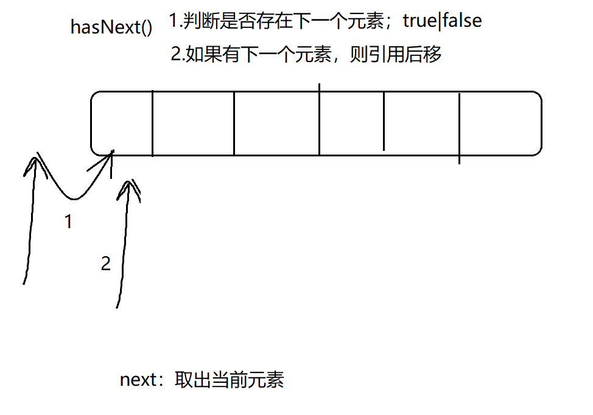
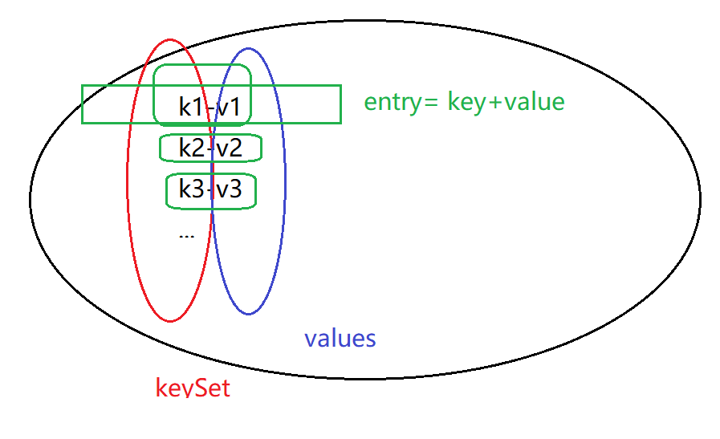
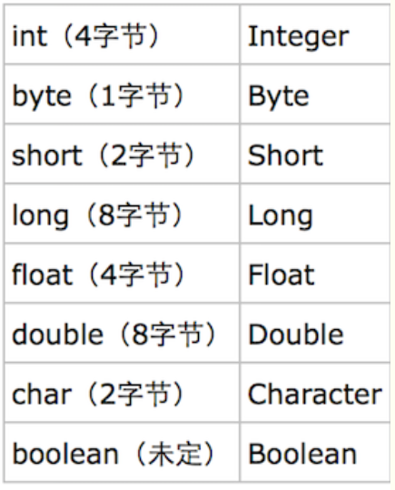

# 

```java
颜群老师微信：157468995
```


Collection：存储的数据是 不唯一、无序的对象

List：存储的数据是 不唯一、有序的对象

Set:存储的数据是 唯一、无序的对象


唯一：不能重复

有序：不是排序；是输入顺序 是否与 输出顺序一致的。


set中的remove（）为什么只能根据 内容删？不能根据下标删？

```java
package col;

import java.util.ArrayList;
import java.util.Collection;
import java.util.HashSet;
import java.util.LinkedList;

/*
 * Created by 颜群
 */
public class Demo01 {
    public static void main(String[] args) {
        Collection list = new ArrayList();
        list.add("中国") ;
        list.add("美国") ;
        list.add("俄罗斯") ;
        System.out.println(list);


        LinkedList list2 = new LinkedList();
        list2.add("hello") ;
        list2.add("world") ;
        //LinkedList独有的方法
        list2.addLast("wh");
        list2.addFirst("hw");

//        list2.remove(1) ;
        list2.remove("world");

        System.out.println(list2);

        HashSet set = new HashSet() ;
        set.add("aa") ;
        set.add("bb") ;
        set.add("cc") ;
        set.remove("bb") ;//因为 set是无序的，因此无法根据“下标”删。只能根据内容删
        System.out.println(set);
    }
}

```

map中的key是唯一的；value是不唯一的


删除：

Collection中的类（List、Set），删除的返回值是 boolean；

Map中的类，是根据Key删除，返回值是value.

```java
package col;

import java.util.Collection;
import java.util.HashMap;
import java.util.Set;

/*
 * Created by 颜群
 */
public class Demo02 {
    public static void main(String[] args) {
        HashMap map = new HashMap() ;
        map.put( "s01","张三")  ;//key:学号 ，value:姓名
        map.put( "s02","李四")  ;
        map.put( "s03","王五")  ;
        map.put( "s04","王五")  ;

        System.out.println(map);

        Object v = map.get("s01");//根据key，找到value

        System.out.println( v);

        System.out.println(map.size());
        //判断是否 包含了指定的Key
        System.out.println(    map.containsKey("s01")              );
        //判断是否 包含了指定的value
        System.out.println(    map.containsValue("王五")              );

        //将Map转为单值集合
        //转为只包含了key的单值集合

        Set set = map.keySet();//为什么是set，不是list?因为map中，key是唯一的
        System.out.println(set);

        //转为只包含了value的单值集合
        Collection values = map.values();
        System.out.println(values);

        Object a = map.remove("s01");//删除的返回值，就是删除的 value对象
        System.out.println(map);
        System.out.println(a);

    }
}

```

如何遍历集合？list  set   map

（1）循环for（普通for[只适用于‘有序’的集合]，增强for[建议]）

（2）迭代器

```java
public interface Iterator<E> {...}
```



```java
package col;

import java.util.*;

/*
 * Created by 颜群
 */
public class Demo03 {
    public static void main(String[] args) {

        List list = new ArrayList() ;
        list.add("aa") ;
        list.add("bb") ;
        list.add("cc") ;
        //普通for
        for(int i=0;i<list.size();i++){
            System.out.println(   list.get(i));
        }
        System.out.println("增强for");
        //增强for
        for(Object o :list){
            System.out.println(o);

        }

        Set set = new HashSet() ;
        set.add("A");
        set.add("b");
        set.add(1);
        set.add("D");
        //普通for，不适用于 “无序”的集合
//        for(int i=0;i<set.size();i++){
//            System.out.println(      set.get );
//        }

        for(Object e :   set){
            System.out.println(e);
        }
        System.out.println("迭代器");

        Iterator iterator = set.iterator();
        while(iterator.hasNext()){
            Object o = iterator.next();
            System.out.println(o);
        }

    }
}

```

遍历map：将双值集合 ，转为单值集合。

map -> keySet

map->values

```java


        System.out.println("遍历map。。。");
        Map map = new HashMap() ;
        map.put("s01","Zs") ;
        map.put("s02","ls") ;
        map.put("s03","ww") ;
        Set set1 = map.keySet();//将双值集合 降成单值集合
        for(Object o :set1){
            System.out.println("key:" +o);
            Object v = map.get(o);//map可以根据key，获取value; map.get(key) ->value
            System.out.println("value:"+v);

        }

//        Collection values1 = map.values();
//        Iterator iterator1 = values1.iterator();
//        while(iterator1.hasNext()){
//            System.out.println("value: "+iterator1.next() );
//        }

        System.out.println("通过entry遍历..");
        Set entries = map.entrySet();

        for(Object e :entries){
            Map.Entry et =  (Map.Entry)e ;
           Object k =  et.getKey();
            Object v = et.getValue();
            System.out.println("k-"+k);
            System.out.println("v-"+v);
        }
```




## 泛型

Collection、Map接口中都可以使用

自jdk1.5开始提供。

作用：

（1）数据安全

（2）防止类型转换时出错

list.add(默认是Object)

如果加了Double泛型，则自动变成 list.add(double...)，返回值类似，会直接返回double类型的数据

简言之，以Double泛型为例。如果不加泛型，则默认操作的是Object类型，如果加了Double泛型，则默认操作的是Double类型。

```java
package col;

import java.util.*;

/*
 * Created by 颜群
 */
public class Demo04 {
    public static void main(String[] args) {
//        List<String> list = new ArrayList<String>() ;
        List<String> list = new ArrayList<>() ;//jdk1.7之后提供类型推断
        list.add("a") ;
//        list.add(1) ;
        String s = list.get(0);
        System.out.println(s);

        Set<String> set =new HashSet<>() ;
        set.add("aa") ;

        //Key(学号s01),Value（名次）
        Map<String,Integer> map = new HashMap<>() ;
        map.put("s01",3);
        map.put("s02",1);
        map.put("s03",2);

        Set<Map.Entry<String,Integer>>  entries = map.entrySet();
        for(Map.Entry<String,Integer> entry :entries){
            System.out.println(  entry.getKey());
            System.out.println(  entry.getValue());
        }


        System.out.println("迭代器中...");
        //取key
        Set<String> keys = map.keySet();
        //遍历Key
        Iterator<String> iterator = keys.iterator();
        while(iterator.hasNext()){
            String key = iterator.next();
            Integer value = map.get(key) ;
            System.out.println(key+"--"+value);
        }


    }
}

```

示例：根据人的名字，查询这个人的全部信息。

```java
package col;

import javax.sound.midi.Soundbank;
import java.util.HashMap;
import java.util.Map;
import java.util.Scanner;
import java.util.Set;

/*
 * Created by 颜群
 */
public class Demo05 {
    public static void main(String[] args) {
        Map<String,Person> map = new HashMap<>() ;
        Person p1 = new Person("zs",23,"xa");
        Person p2 = new Person("ls",24,"bj");
        Person p3 = new Person("ww",25,"sh");
        Person p4 = new Person("zl",26,"sz");
        Person p5 = new Person("sq",27,"tj");

        //key:名字    value:人
        map.put("zs",p1);
        map.put("ls",p2);
        map.put("ww",p3);
        map.put("zl",p4);
        map.put("sq",p5);

        System.out.println("请输入人的名字：");
        Scanner in = new Scanner(System.in) ;
        String name = in.next();

        Person person = map.get(name);
        System.out.println(person);//如果不是null,在打印时会调用toString；如果是null，则不调用。
//        System.out.println(person.toString());


//        Set<String> names = map.keySet();
//        //在names中查找name
//        for(String n :names){
//            if(n.equals( name )){
//                Person person = map.get(n);
//                System.out.println(person);
//            }
//        }
    }
}

```


## 集合工具类

集合工具类Collections：排序、复制、翻转等操作

数组工具类Arrays    排序、复制、翻转等操作  ,Arrays.sort(数组)

```java
package col;

import java.util.ArrayList;
import java.util.Collections;
import java.util.List;

/*
 * Created by 颜群
 */
public class Demo06 {
    public static void main(String[] args) {
        List<String> list = new ArrayList<>();
        list.add("w") ;
        list.add("a") ;
        list.add("b") ;
        list.add("x") ;
        list.add("a") ;
        list.add("i") ;

        Collections.sort(list);
        System.out.println(list);

        System.out.println(   Collections.max(list) );
        System.out.println(   Collections.min(list) );

        //二分查法(使用前，必须保证集合元素是 自然有序的)
        System.out.println(  Collections.binarySearch( list,"i")     );
        //混洗，洗牌：打乱已有顺序
        Collections.shuffle(list);
        System.out.println(list);
        Collections.shuffle(list);
        System.out.println(list);

        Collections.reverse(  list);
        System.out.println(list);

        Collections.swap(list,  2,3);
        System.out.println(list);

        Collections.replaceAll(list, "a","A") ;
        System.out.println(list);

        Collections.fill(list,"H");
        System.out.println(list);
    }
}

```

```java
package col;

import java.util.Arrays;

/*
 * Created by 颜群
 */
public class Demo07 {
    public static void main(String[] args) {
        int[] arr = new int[]{3,2,14,6,1};
        Arrays.sort(arr);

        for(int i=0;i<arr.length;i++){
            System.out.println(arr[i]);
        }
//
//        Arrays.fill(arr,5);
//        for(int i=0;i<arr.length;i++){
//            System.out.println(arr[i]);
//        }

        Arrays.sort(arr);
        //通过二分法，在arr中查找2的下标（前提是 数组已经排好序）
        int position = Arrays.binarySearch(arr, 2);
        System.out.println(position);


    }
}

```


比较器

list.add(3) ;  //2 4  3 1  9  

list.add("b") ;  //b c  a d  w  

Collections.sort(list)  //能够识别一些自然顺序  


但是，如果集合中的元素是 用户自定义对象，如何排序？

Person p1 = new Person(3,"zs",23,6) ;

Person p2 = new Person(2,"ls",24,2) ;

Person p3 = new Person(1,"ww",25,8) ;

list.add(p1);

list.add(p2);

list.add(p3);

Collections.sort(list)  //程序 无法知道 ，是根据什么排序？  ->自定义比较器， 自定义“比较时，根据学号排”


自定义比较器：Comparable 、Comparator

Comparable:  内部比较器（侵入性，需要修改原有代码）

```java
package col;

/*
 * Created by 颜群
 */
public class Person implements Comparable{
    private int id ;
    private String name ;
    private int age ;
    private String city;
    public Person() {
    }


    public Person(int id, String name, int age, String city) {
        this.id = id;
        this.name = name;
        this.age = age;
        this.city = city;
    }
    public Person( String name, int age, String city) {
        this.name = name;
        this.age = age;
        this.city = city;
    }

    public int getId() {
        return id;
    }

    public void setId(int id) {
        this.id = id;
    }

    public String getName() {
        return name;
    }

    public void setName(String name) {
        this.name = name;
    }

    public int getAge() {
        return age;
    }

    public void setAge(int age) {
        this.age = age;
    }

    public String getCity() {
        return city;
    }

    public void setCity(String city) {
        this.city = city;
    }

    @Override
    public String toString() {
        return "Person{" +
                "id=" + id +
                ", name='" + name + '\'' +
                ", age=" + age +
                ", city='" + city + '\'' +
                '}';
    }

    //重写比较器接口中的方法

    /*
        {1,3,5,7  }升序
        {7,5,3,1  }降序
        //输入源   3     1  7  5
           {3}

        返回值：
            1正数：当前对象大，    降序
            -1负数：传入的对象大 ，升序
            0：一样大
     */
    @Override
    public int compareTo(Object o) {
        Person inputPerson = (Person)o ;
        //根据学号，降序
       int result =  this.id > inputPerson.id ?-1  : (   this.id   ==    inputPerson.id ?0:1 ) ;
       //如果学号相同，再根据姓名升序.  za  zs
        if(result  == 0 ){
            result = this.name .compareTo(      inputPerson.name) ;//调用String已经重写过的compareTo()
        }
        return result;
//        return 1;//当前对象，比传入对象大
    }
}

```

思路：将比较的对象（Person）实现Comparable接口，重写连的compareTo()方法。在compareTo()中编写比较的逻辑。重点是返回值，-1 ，0,1  ；  

Comparator：外部比较器 （无侵入性，不影响原有代码）

1.先定义一个外部比较器

```java
package col;

import java.util.Comparator;

/*
 * Created by 颜群
 */
public class MyComparatorWithId implements Comparator {
    @Override
    public int compare(Object o1, Object o2) {
        Student s1 =  (Student)o1 ;
        Student s2 =  (Student)o2 ;
        return   s2.getId() -  s1.getId()  ;
    }
}

```

2.使用外部比较器

```java
package col;

import java.util.ArrayList;
import java.util.Collections;
import java.util.List;

/*
 * Created by 颜群
 */
//内部比较器
public class Demo08 {
    public static void main(String[] args) {
        List<Person> persons = new ArrayList<>() ;
        Person p1= new Person(10,"zs",23,"xa") ;
        Person p2= new Person(2,"ls",24,"xa") ;
        Person p3= new Person(2,"zs",25,"xa") ;
        persons.add(p1) ;
        persons.add(p2) ;
        persons.add(p3) ;

        Collections.sort( persons );

        System.out.println(persons);
        System.out.println("-------");
        Student s1 = new Student(10,"zs",23,"xa") ;
        Student s2 = new Student(2,"zs",26,"xa") ;
        Student s3 = new Student(3,"zs",24,"xa") ;
        List<Student> students = new ArrayList<>() ;
        students.add(s1);
        students.add(s2);
        students.add(s3);

        Collections.sort(  students,new MyComparatorWithId() );//给students使用了MyComparatorWithId比较器
        System.out.println(students);

    }
}

```


List<Double> list = new ArrayList<>() ;

包装类（自动装箱、自动拆箱）


evething  is an Object，万物皆对象。 属性、方法

自动装箱：基本类型 ->包装类型 ,int ->Integer

自动拆箱：包装类型->基本类型,Integer ->int


java中 将8个基本类型，包装成了8个对象类型（引用类型）。这8个对象类型 就成为包装类



```java
package col;

/*
 * Created by 颜群
 */
public class BZL {
    public static void main(String[] args) {
        int i = 10 ;

        Integer j = new Integer(20) ;
        i = j ;//Integer->int  自动拆箱 底层用的是intValue()
        j = i ;//int ->Integer 自动装箱 底层用的是valueOf() ,该方法中有个缓冲区 [-128,127],如果要装箱的数字 在缓冲区范围以内，则直接从缓冲区中取；否则，new Integer()一个新对象


        Integer i1 = 100 ;
        Integer i2 = 100 ;


        Integer i3 = 1000 ;
        Integer i4 = 1000 ;
        System.out.println(i1 == i2);
        System.out.println(i3 == i4);

    }
}

```

