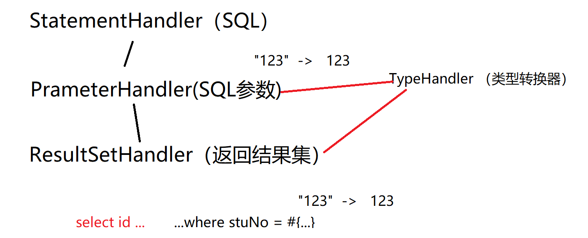
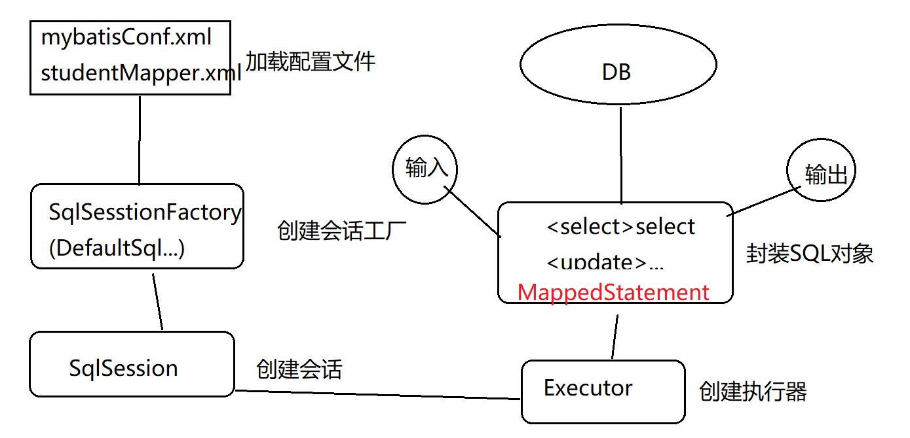
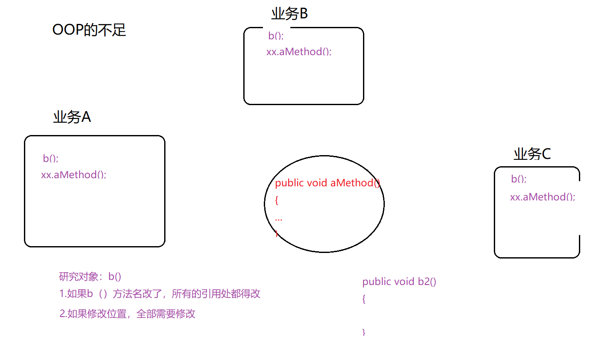
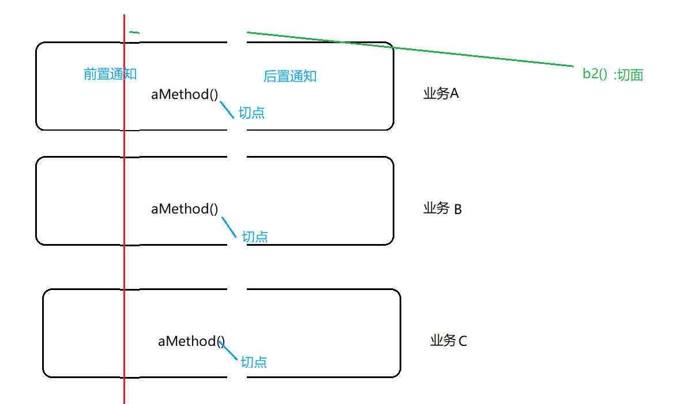
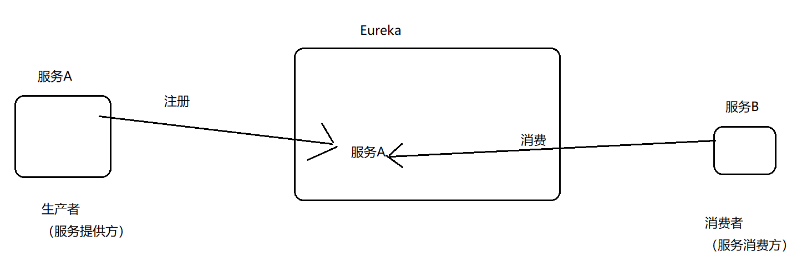
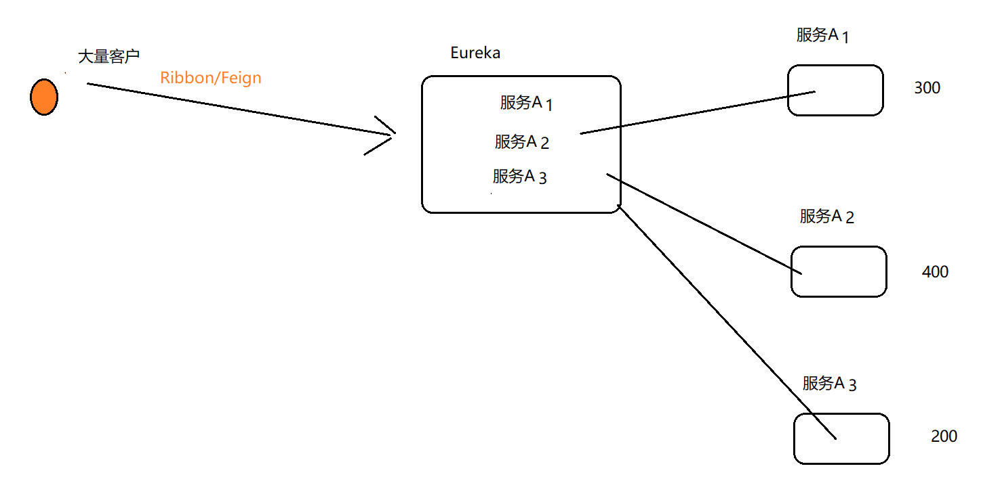
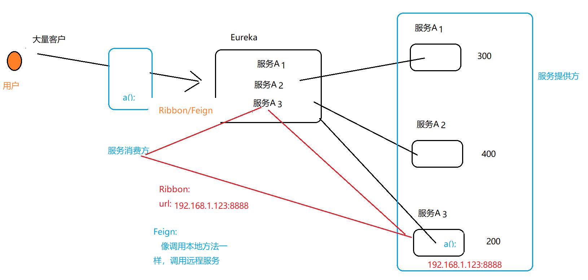
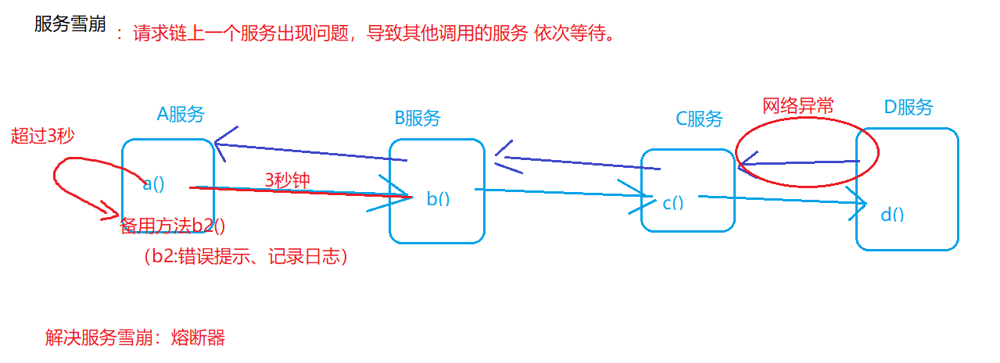

# SSM和开源框架

MyBatis重要组件：

- Mapper配置：  实体类Student.java - 数据表student ,   XML或注解
- Mapper接口： DAO层接口。 （只需要写接口，不用写实现类 ：需要遵循约定）

Mapper接口在编写时 需要遵循约定：

1.方法名和SQL配置文件（studentMapper.xml）中的id值必须相同

2.方法的输入参数，必须和SQL配置文件的 parameterType的类型相同；

3.方法的返回值，必须和SQL配置文件的resultType的类型相同

SQL配置文件

```sql
<select id="queryStudentByNo"  parameterType="int"  resultType="lanqiao.entity.Student" >
	select * from student where stuNo = #{stuNo}
</select>
```

接口

```sql
<select id=" queryStudentByNo" parameterType="int"  resultType="Student"> 
 select * from student where stuNo=#{stuNo} 
</select>
```

根据约定，编写接口

```java
public interface StudentMapper
{
  Student queryStudentByNo(int stuNO)
   List<Student> queryStudentByNo()
}
```

特殊：

1.如果不存在parameterType ，则代表是一个无参方法

2.如果不存在resultType，则代表返回值是void

3.如果方法的返回值是一个集合类型，则实际resultType仍然是元素类型，而不是集合类型。


## MyBatis开发时的常用对象

1.SqlSessionFactory：SqlSesssion工厂。通过SqlSessionFactory：SqlSesssion中的openSession()产生SqlSesssion对象。

2.SqlSesssion：SqlSesssion对象（类似于JDBC中的Connection）

3.Executor：MyBatis中所有Mapper语句的执行 都是通过Executor进行的。


## MyBatis四大核心对象 

1.StatementHandler(负责sql语句)：数据库的处理对象 select... from where id = #{}  ..

2.PrameterHandler(负责sql中的参数)：处理SQL中的参数对象  

3.Executor

4.ResultSetHandler：处理SQL的返回结果集


## MyBatis四大处理器

StatementHandler、PrameterHandler、ResultSetHandler

剩下一个：TypeHandler （类型转换器）



## 执行流程



## 一对一、一对多，延迟加载

一对一

```java
使用<resultMap>中<association>
一对一的延迟加载：
使用<resultMap>中<association>的select属性指定延迟加载的sql语句
<resultMap>	
		<association select="延迟加载的sql语句" >
		<<association>>
</resultMap>


```

一对多：将一对一中的<association>改为<collection>


# Spring

IOC/DI：控制反转/依赖注入

目的：解耦合


Student2 student = new  Student2()  使用new会造成耦合度较高 ->工厂模式

类- >new ->对象


类- > 工厂模式->对象  ，可以实现解耦，问题是：需要自己编写工厂


IOC：IoC帮我们提供了一个工厂。  1.向工厂中注入对象 （配置[xml、注解]）  2.从工厂中获取对象

总结：Ioc可以让我们通过“配置的方式”来创建对象


## AOP:面向方面编程

OOP的补充，不是替代。

使用oop的不足：




以上OOP两个不足，可以通过AOP进行改进。



使用AOP的实际场景：

日志、安全统一校验 


## Spring用到了那些设计模式

工厂模式：创建bean、获取bean

单例模式/原型模式： 创建bean时，设置作用域 ，singleton/prototype

监听模式：自定义时间发布，监听模式。如ApplicationListener，当某个动作触发时，就会自动执行一个通知。

以前（不用spring boot），需要自己配置框架的配置文件。

spring,mybatis  ,SSM整合等情况 需要编写一大堆配置文件。


如果使用Spring Boot，则可以省略配置 。 好处：将开发重点放在业务逻辑上，而不是配置上。


自动装配的原理？  约定优于配置  (核心：将一些配置功能，前置到源码底层实现好)


自动装配两个特点：

1.版本仲裁中心：因此，以后引入依赖时，不用再写版本号。好处：1.不用记  2.避免冲突(防止引入多个引来时，由于各个依赖的版本不兼容造成的冲突)

2.提供了很多starter(场景启动器) ：批量jar。  

假设开发web项目  ( json.jar  tomcat.jar  hibernate-validator.jar, spring-web.jar ... )  => spring-boot-starter-web.

以后使用web项目，只需要引入spring-boot-starter-web


自动装配的应用时： @EnableAutoConfiguration 就是springboot提供自动装配的 注解。


## Spring Cloud


Spring Cloud：微服务治理框架

内置了许许多多的组件

## Eureka 

服务注册中，类似于dubbo中的zookeeper.



换个角度：Eureka也可以理解为 两个组件 Eureka Server和Eureka Client。

需要注意：Eureka Client有两个角度：如果站在eureka来看，是一个 客户端；如果站在系统角度来看，是一个服务端。


## Ribbon

客户端负载均衡工具




## Feign

声明式客户端负载均衡工具

Feign是建立在Ribbon之上。

Feign与Ribbon的区别： Ribbon面向URI地址的；Feign面向接口的




## 熔断器



熔断器：Hystrix  


```java
@HystrixCommand(fallbackMethod="b2")
public void a()
{
    
    b();//远程
}

puyblic void b2()
{
    ...
    
}
```


颜群微信157468995


