# 分布式核心设计

## 简介

最火？

大数据、人工智能、区块链、边缘计算、微服务   -> 分布式

分布式：拆

微服务&分布式 

分布式：拆了就行

微服务：纵向拆分(根据业务逻辑拆分，电商:用户、支付、购物...)、最小化拆分

横向：jsp/servlet -> service->dao

## CAP理论

任何一个分布式系统 都必须重点考虑的原则。

C:一致性（强一致性）：所有子节点中的数据 时刻保持一致

A：可用性：整体能用

P:分区容错性 ：允许部分失败

CAP理论：在任何分布式系统中，C\A\P不可能共存，只能存在两个。

基础知识：一般而言，至少要保证P可行，因为分布式 经常会出现 弱网环境。因此 就需要在C和A之间二选一。

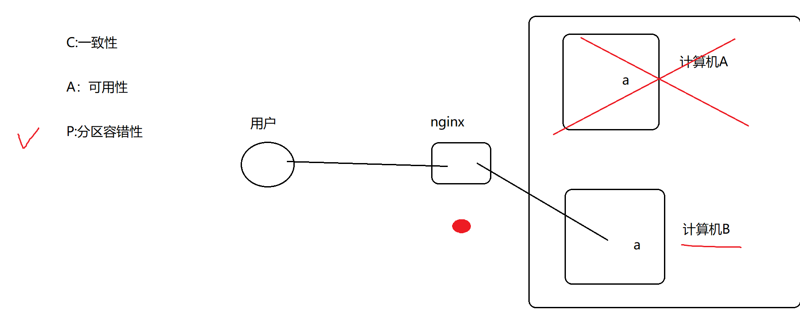

## BASE理论

为了弥补CAP的不足。

尽最大努力 近似的实现 CAP三者：最终一致性 代替强一致性C

前置： 强一致性（时时刻刻一致、短时间内一致）、最终一致性（只要最后一致即可）

**BASE理论：首选满足A\P，  因此不能满足C。但是可以用 最终一致性 来代替C。**

BASE：Basically Available 基本可用

软状态：多个节点时，允许中间某个时刻数据不一致。

最终一致性

## 分布式缓存

缓存问题

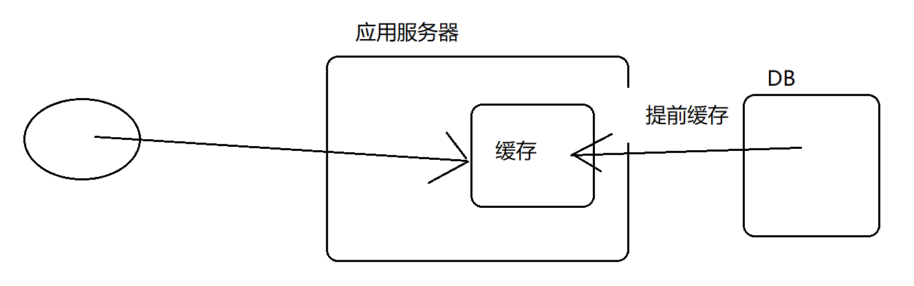

缓存击穿：某一个热点数据过期，造成大量用户请求直奔DB的现象。

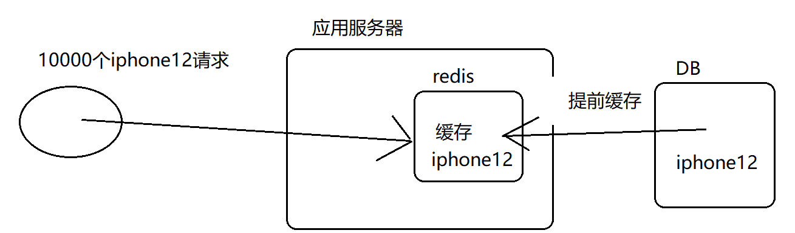

解决：1.监控线程    2.提前设置好时间，保证热点数据在 高峰期 不过期

缓存雪崩：大量缓存全部失效 （个大量缓存设置了相同的过期时间 ; 缓存服务器故障）

解决：1.合理分配缓存的过期时间  2.搭建缓存集群

缓存穿透：恶意攻击。一般而言，不会缓存一些无意义的数据。但是如果恶意工具，就可以利用一些无意义的数据 反复发起请求。 

解决：将无意义的数据也进行缓存，并且将过期时间设置的相对短一些。

以上的本质都是“缓存失效”，通用的解决方案：二级缓存（分布式缓存）

一般而言，本地缓存 是一级缓存，分布式缓存是二级缓存。

## 一致性hash

hash算法：映射

字符串、图片、对象  -> 数字

hash(a.png  ) -> 12312313

一致性hash最初用于解决分布式缓存问题

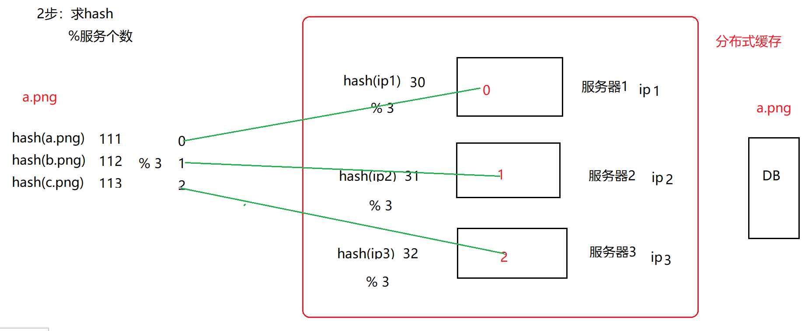

以上 将 数据 映射到 某个缓存服务器的做法 有一个问题： 当服务器个数发生改变时，缓存会失效。

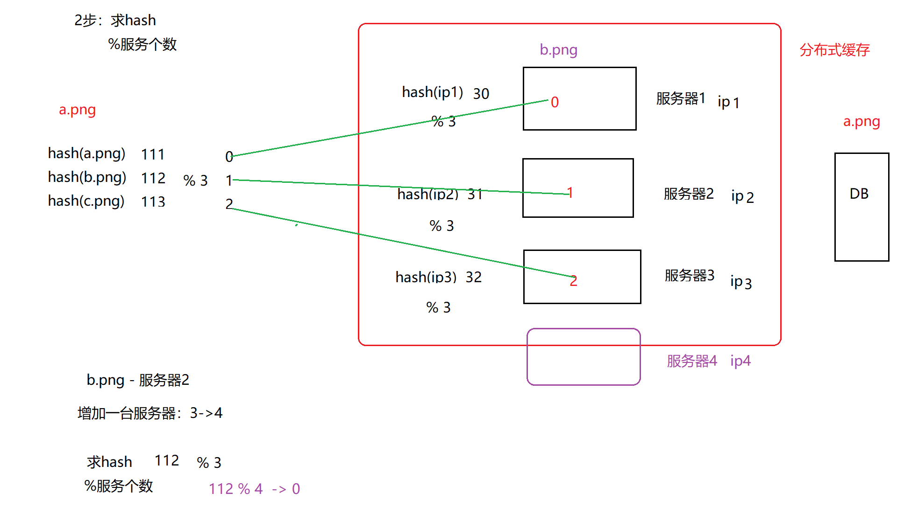

解决“服务器个数改变导致的问题”：一致性hash

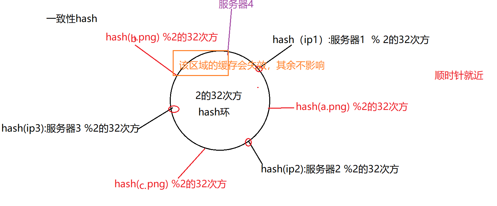

hash偏斜问题

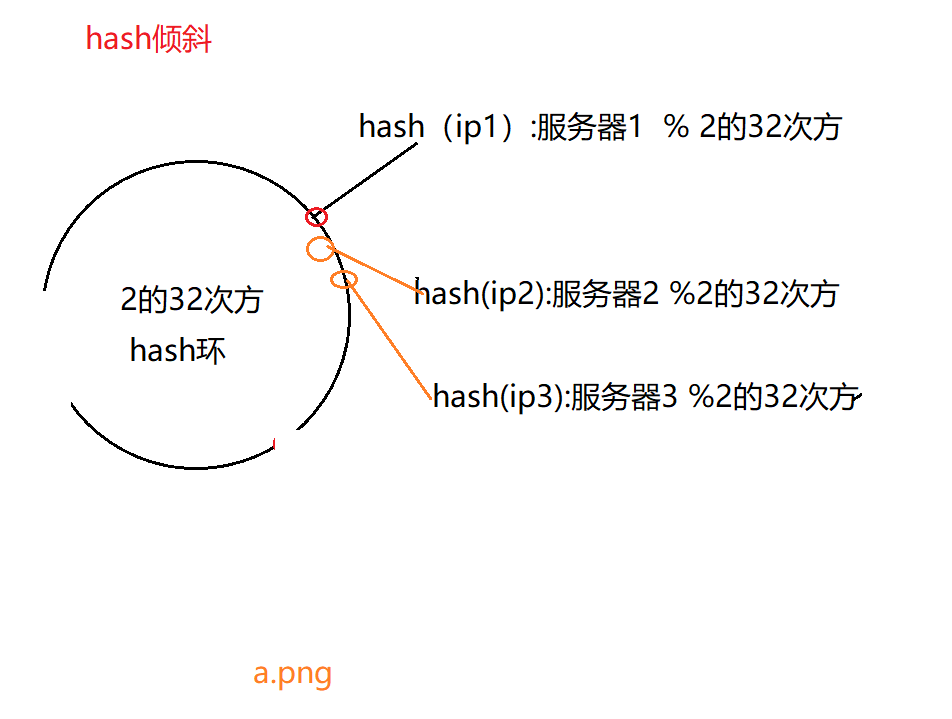

解决hash倾斜问题：虚拟节点

在换上生成多个 虚拟节点，后续 请求先找虚拟节点，然后在通过虚拟节点找到对应的真实节点

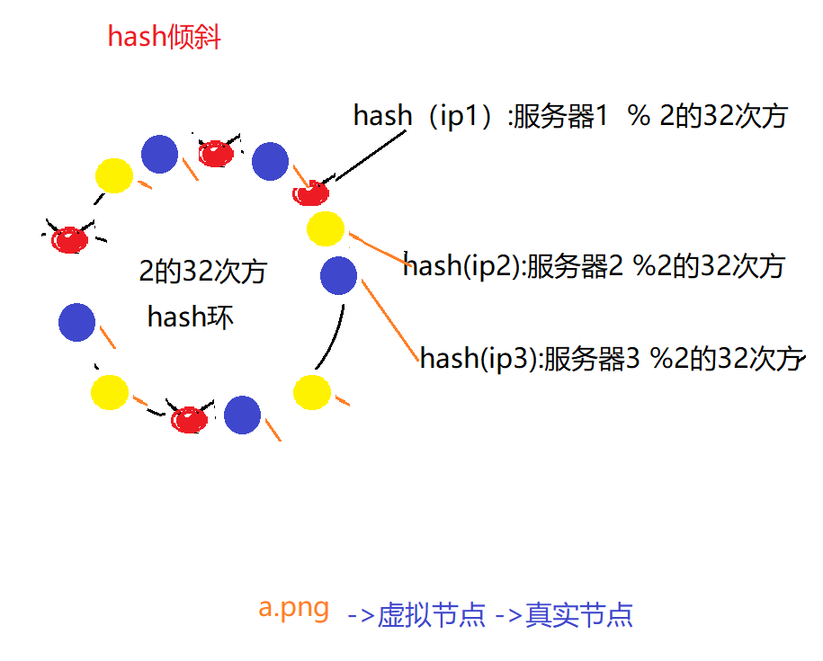

## 缓存一致性

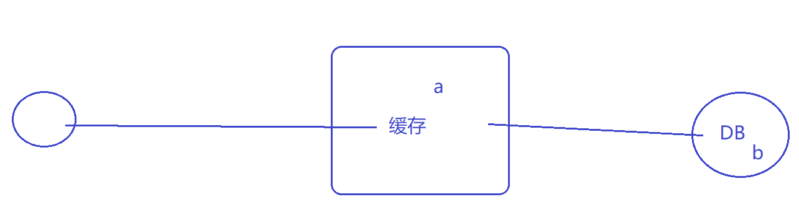

（思考）

最容易想到，但也不推荐的做法： **当DB更新后，立刻更新缓存** ； 先删除缓存，在更新DB。

推荐： 当DB更新后，立刻删除缓存

分析：（反例）

当DB更新后，立刻更新缓存（不推荐）

问题：

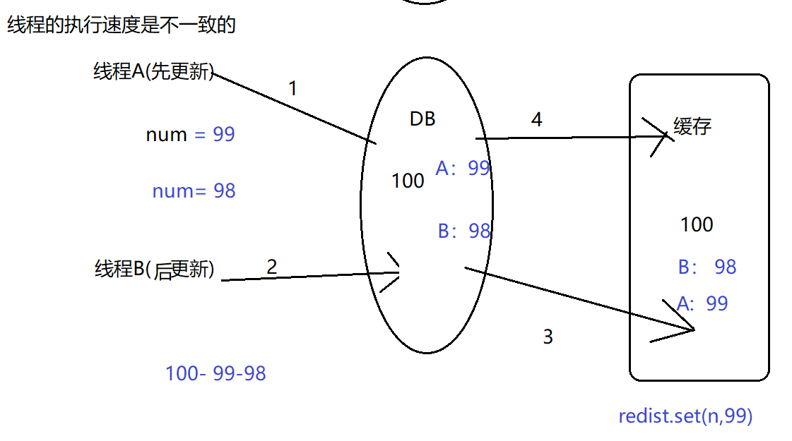

如果线程A先更新，线程B后更新，最终的结果 可能是A的结果。原因：线程的执行速度可能不一致。

**推荐： 当DB更新后，立刻删除缓存**  。因为：对于删除来说，没有速度的先后问题（没有速度不一致的问题）

（这种推荐的方式，仍然会存在 一个 极小概率 的错误情况）

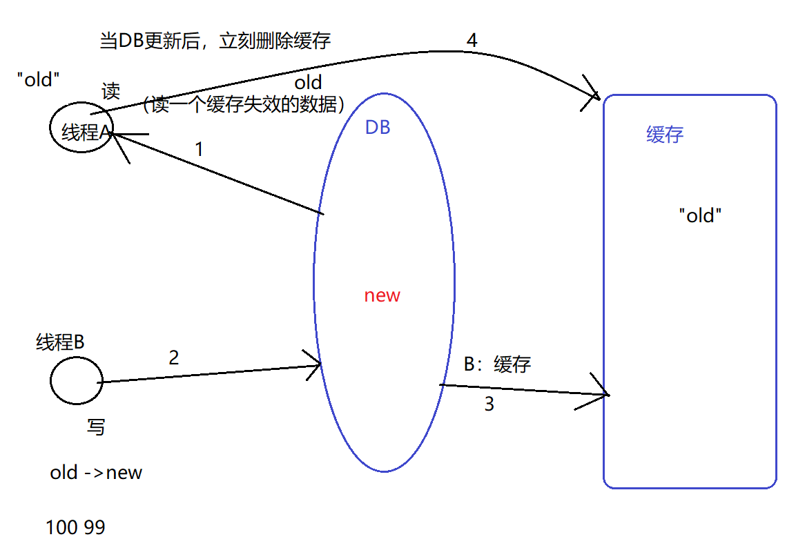

以上就是这个推荐方式的一个错误情况，但发生的概率是极小的：1.发生在“缓存失效”的前提下 2.发生的前提：写线程的速度 要 快于 读线程，基本不可能。

问：这个 极小的错误情况，能否避免？

答：能！以上错误发生的大前提：读操作 和写操作 交叉执行，解决思路：让二者 不要交叉。 加锁，或者读写分离。  但是一般建议，不用解决。

能否调换顺序：删除缓存 ,  再DB更新后

反例：

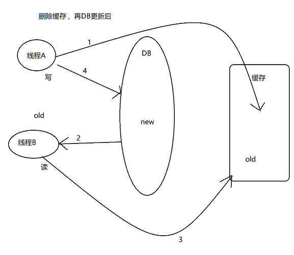

以上出错的前提：写慢，读快。因此发生的概率较大。

## 分布式锁

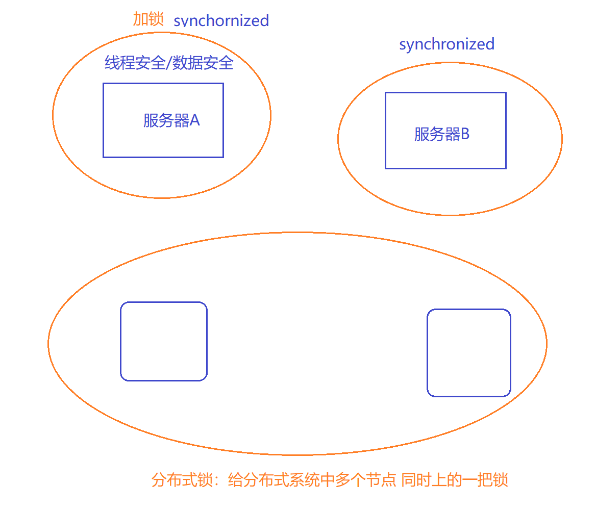

分布式锁：数据库的唯一约束、redis、Zookeeper

在架构开发： 没有最好，只有比较合适的。

## 使用Zookeeper实现分布式锁

zookeeper:分布式协调框架， 组成结构是 一个颗树（类似于DOM树）

树种包含很多叶节点，在分布式锁中使用的 叶节点类型： 临时顺序节点。

zookeeper提供了以下两种支持：

- 监听器：可以监听某个节点的状态，当状态发生改变时 则触发相应的事件
- 临时节点的删除时机：当客户端与访问的临时节点 断开连接时 

锁：同一个时间内，只能有一个线程/进程访问

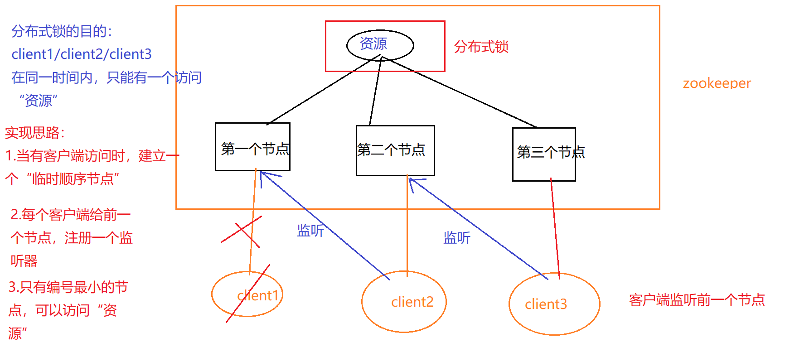

## 分布式事务

本地事务：一个事务对于一个数据库连接。（事务：连接 = 1： 1）

凡是不符合上述1:1关系的，都不能使用本地事务，举例如下（以下都无法使用本地事务）：

1.单节点中存在多个数据库实例。在本地 建立了2个数据库： 订单数据库、支付数据库。

下单操作  = 订单数据库+支付数据库

2.分布式系统中，部署在不同节点上的多个服务访问同一个数据库。

通过以上两点说明：本地事务的使用性 十分有限。

## 分布式事务实现

示例

下单操作  = 订单数据库   +支付数据库

服务器A： 下单操作 ，  订单数据库 

服务器B:   支付数据库

模拟分布式事务：下单操作

begin transaction:

1.执行 订单数据库;

2.执行 支付数据库

commit/rollback ;

以上，在分布式环境中存在问题：

begin transaction:

1.在本地（服务器A） 执行 订单数据库;

2.远程调用服务器B上的   支付数据库

commit/rollback ;

以上的错误情况：如果本地的订单服务 成功、远程的支付也成功，但是在 响应时由于网络等问题  无法响应，就会让用户以为 下单失败。

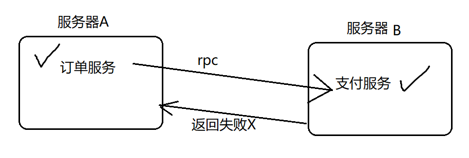

以上，本地事务无法操作的情况，就可以使用分布式事务。

### 使用2PC实现分布式事务

2pc：2 phase  commit  ，由一个协调者 和多个 参与者组成  （类似master-slave结构）

 协调者： 事务管理器,TM

 参与者： 资源管理器,RM

两阶段指的是：

准备阶段(Prepare阶段)：当事务开始时，协调者向所有的参与者发送 Prepare消息，请求执行事务。参与者接收到消息后，要么同意，要么拒绝。如果同意，就会在本地执行事务，记录日志，但是不提交。

提交阶段（commit阶段）：如果所有的参与者都同意，协调者再次给全部参与者发送 提交请求。否则进行回滚。

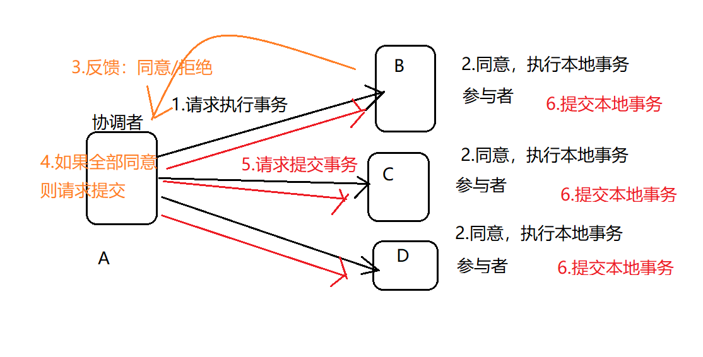

总体思路： 将一个任务（多个步骤） 进行2步操作：  1.请求各个节点执行   ；  2.如果大家都同意，请求一起提交

2pc缺点：1.分布式事务在执行期间是阻塞式的，因此会带来延迟    2.如果协调在第“5”步遇到弱网环境，可能造成一部分节点 没有commit的情况。  3.中心化架构，单点灾难。

其他分布式事务解决方案：三阶段提交，使用TCC实现分布式事务，使用消息队列实现分布式事务

注意：如果要严格的保证事务一致性：paxos算法。  google chubby作者

## 分布式认证 &分布式授权

认证方式：系统自己开发 、 三方平台

系统自己开发：分布式认证

三方平台：分布式授权 （SSO单点认证）

**分布式授权：  OAuth2.0授权协议**  ，该协议的流程如下：

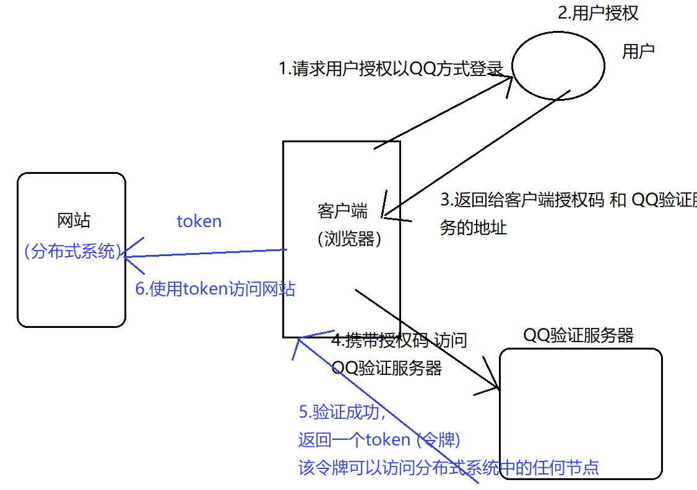

提示：发展史上， OAuth2.0 不兼容 OAuth1.0

颜群微信157468995

